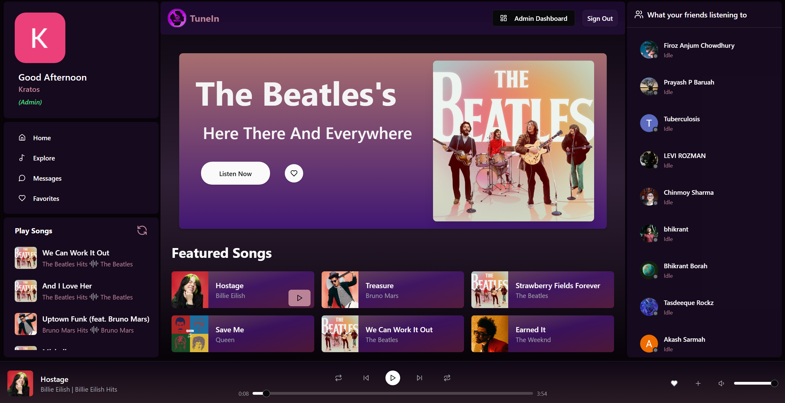
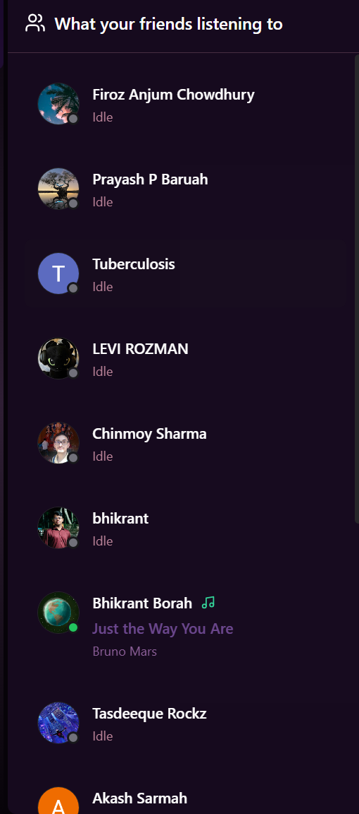
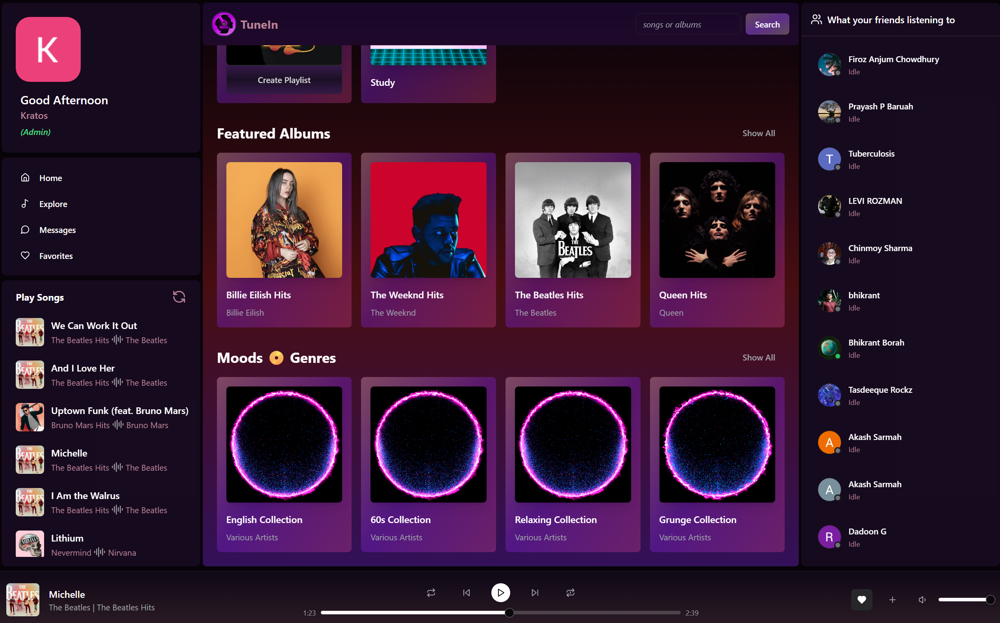
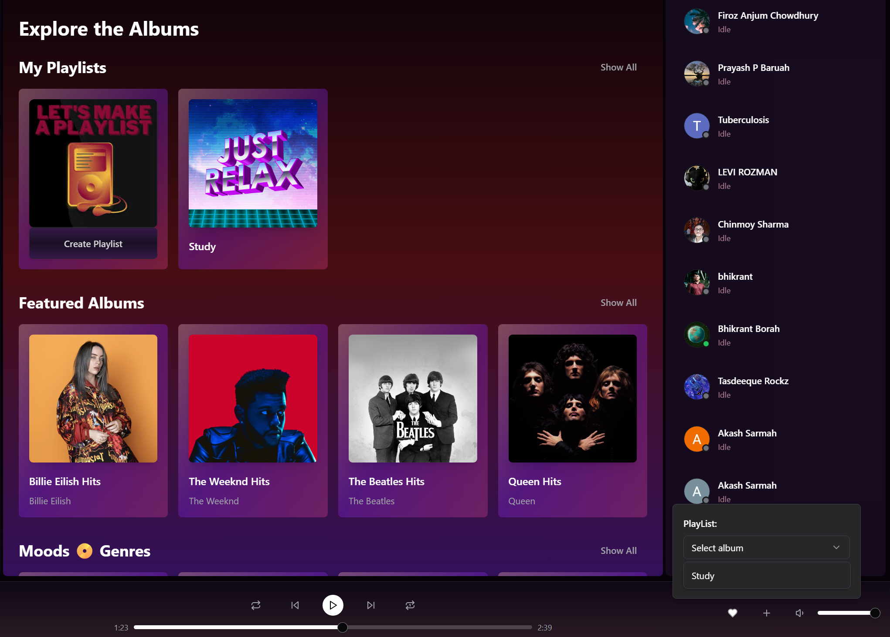
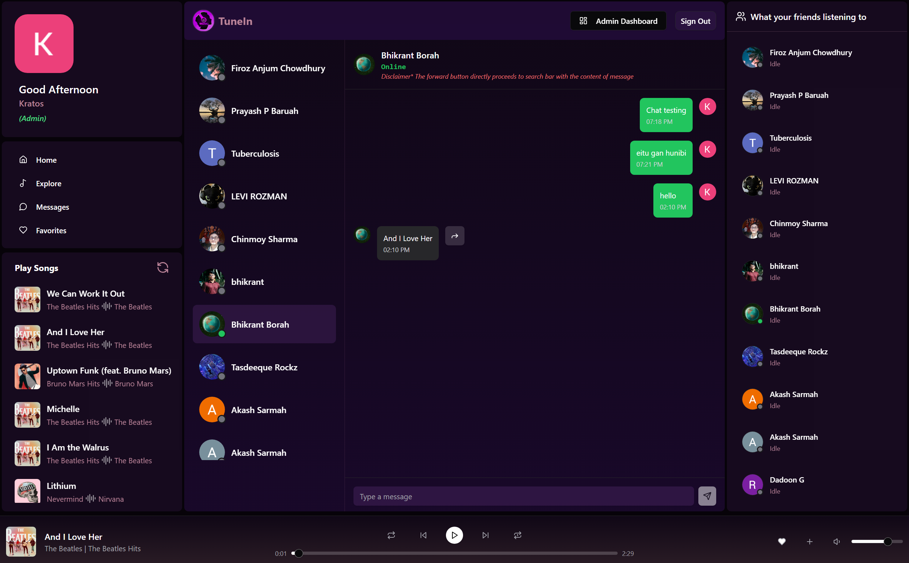
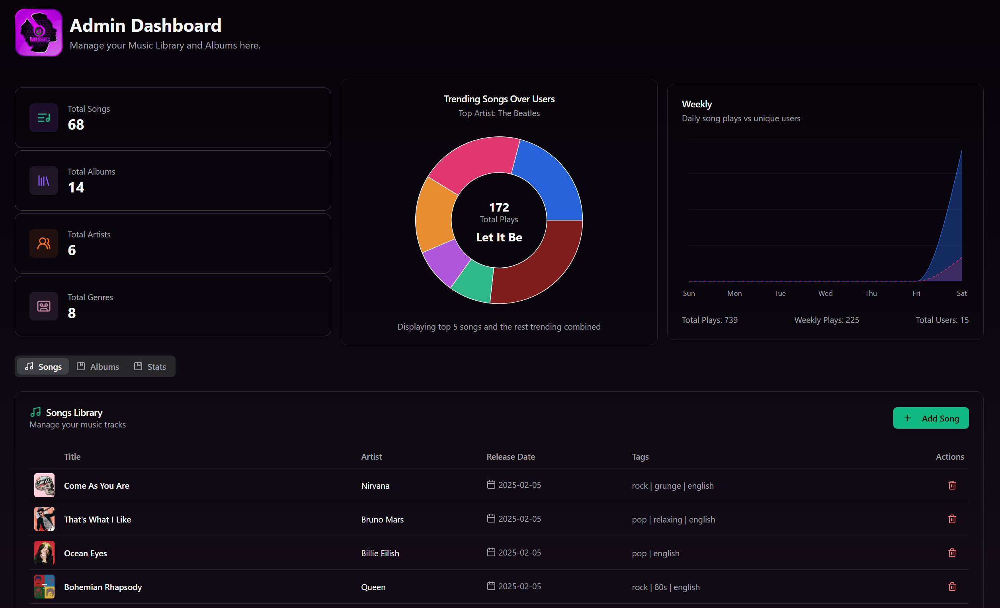
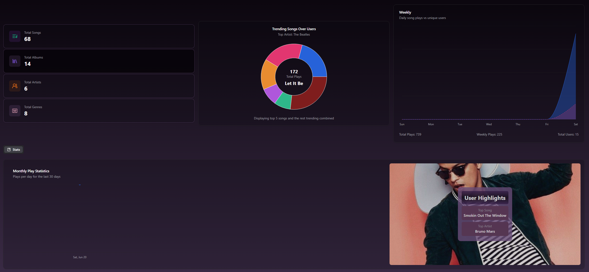
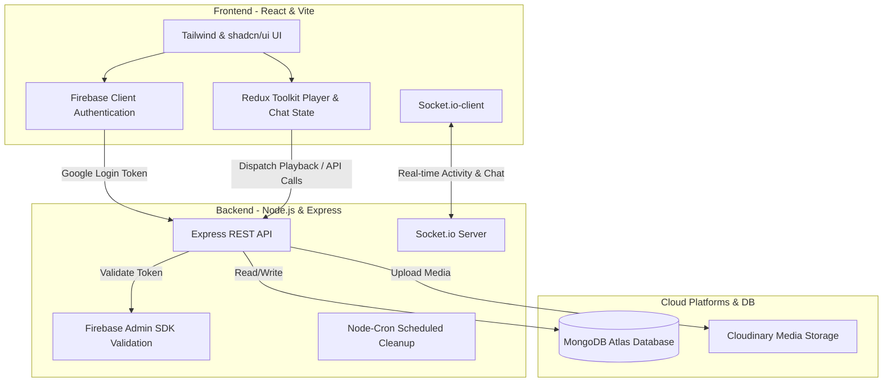

# 🎵 TuneIn — Premium Music Streaming & Social App

TuneIn is a state-of-the-art, full-stack music streaming platform designed to bridge high-fidelity playback with real-time social interaction. Built using the modern **MERN stack**, integrated with **Socket.io** for instant messaging and live listening updates, **Firebase Auth & Google OAuth** for secure user identity, and **Cloudinary** for scalable audio/artwork asset hosting. 

The application is styled with a gorgeous, premium **dark-glassmorphism theme** using **Tailwind CSS** and **shadcn/ui** components.

---

## 🚀 Tech Stack

### Frontend Architecture
*  &middot; Centralized client-side rendering engine (Vite)
*  &middot; Centralized global state management (audio player, playlist, chat)
*  &middot; Styling & Custom responsive design system
*  &middot; Google OAuth and authentication flows
* **shadcn/ui & Lucide** &middot; Sleek, interactive component framework

### Backend & Cloud Infrastructure
*  &middot; Fast, scalable event-driven Javascript runtime
*  &middot; Backend REST API framework
*  &middot; NoSQL document store (Mongoose ODM)
*  &middot; Bidirectional real-time web sockets for messaging & user activity
*  &middot; Enterprise SaaS audio/image storage

---

## 📖 Table of Contents
1. [Application Visual Guide](#-application-visual-guide)
2. [Core Features & Technical Deep Dive](#-core-features--technical-deep-dive)
3. [System Architecture](#-system-architecture)
4. [Database & Models Design](#-database--models-design)
5. [API Routes Reference](#-api-routes-reference)
6. [Getting Started & Local Setup](#-getting-started--local-setup)
7. [Database Seeding](#-database-seeding)
8. [Admin Features](#-admin-features)

---

## 🖼️ Application Visual Guide

Here are the key interfaces of the app. If you clone the repository, please place your screenshots in the `./assets/screenshots/` directory to display them dynamically:

### 1. Main Streaming Dashboard
> Central hub featuring modern glassmorphism panels, customized navigation sidebars, high-fidelity media controls, featured lists, and the real-time social sidebar.
>
> 

### 2. Live Social Sidebar
> An interactive real-time tracker displaying what tracks and artists your friends are listening to *right now*. An active green music wave indicates live listening, while gray indicates idle status.
>
> 

### 3. Mood & Artist Explore Center
> Search globally or dive deep into personalized categories, featured albums, and custom collections divided by moods and genres (e.g., English, 60s, Relaxing, Grunge).
>
> 

### 4. Dynamic Playlists & Favorites
> Add active tracks or entire albums directly into user-curated folders (like the "Study" playlist) via responsive dropdown menus and favorited toggle controls.
>
> 

### 5. Chat & Social Audio Engine
> Real-time instant messaging using Socket.io. Features direct song card sharing. Shared cards include a **Forward Button (`→`)** that automatically extracts the song query and drops it into the global Search Bar for quick listening.
>
> 

### 6. Admin Analytics Dashboard
> Complete management control center showing platform statistics, songs/albums catalog manager with interactive data grids, and tabbed view for stats.
>
> 

### 7. Stats & Analytics Dashboard
> Interactive data visualizations displaying trending tracks donut chart, weekly listening activity metrics, plays-per-day timeline chart, and personalized user highlights cards.
>
> 

---

## 🛠️ Core Features & Technical Deep Dive

### 🎼 High-Fidelity Audio Playback
* **Seamless Audio Player:** Integrated progress tracking, volume slider, auto-play, repeat, next/prev controls, and background caching, powered by a customized HTML5 Audio ref inside a Redux listener wrapper.
* **Auto-Genre & Visualizers:** Smooth gradients dynamic to the current playing track's artwork (utilizing `colorthief` to extract primary vibrant colors).

### 👥 Real-Time "Listening Live" Feed
* **Socket.io Connection:** Whenever a user plays, pauses, or changes a song, an action is emitted to the server which broadcasts the new `currentActivity` payload to all connected peers in real-time.
* **Online Status:** Instantly shifts user status dot from `idle` (grey) to `listening` (green active wave) when playback begins.

### 🧭 Mood & Genre Explore Engine
* **Filter Collections:** Explore tracks grouped by mood tags (Relaxing, Energetic, Focus) or genres (60s, Rock, Pop).
* **Global Search:** Fuzzy search queries MongoDB databases dynamically, filtering by album name, song title, or artist.

### 📁 Custom Playlists & Favorites
* **Playlist Manager:** Users can construct bespoke playlists.
* **Contextual Popovers:** Quick-add widgets allow users to append the currently playing song or selected album to any custom playlist, or toggle a persistent "Favorites" relation.

### 💬 Real-Time Messaging & Song Forwarding
* **Socket.io Chat Rooms:** Instant user-to-user private chats. Includes real-time status headers showing if your active contact is "Online".
* **Song Card Integration:** Paste or share a song name directly in chat to render a styled media card with the album art.
* **Disclaimer / Forward Feature:** The **Forward Button (`→`)** directly copies the card's song title/artist content and passes it into the explore search query, redirecting the user to find and stream it instantly.

### 📊 Advanced Analytics & Graphs (Admin & User)
* **Admin Platform Performance:**
  * **Trending Songs Donut Chart:** Visualizes overall playback volume across popular tracks (grouping top songs with combined lesser-played ones), highlighting total plays and identifying the top trending song (e.g. "Let It Be").
  * **Weekly Listeners & Plays Chart:** Area chart logging daily song play frequency vs unique active users (Sunday to Saturday) with cumulative metrics for total plays, weekly play counts, and unique users.
  * **Monthly Plays Timeline:** Line chart plotting plays-per-day over the trailing 30 days to monitor server traffic and growth.
* **User Highlights & Metrics:**
  * **Monthly Personalized Highlights:** Displays the user's most listened song and most listened artist over the past month.
  * **Dynamic Artist Showcases:** Features dynamic background imagery corresponding to the user's top artist (e.g., Bruno Mars) with clean typography.

---

## 📐 System Architecture

The following diagram illustrates how user actions flow from the frontend through the API gateway and Socket server down to database schemas and Cloudinary:



---

## 🗄️ Database & Models Design

Mongoose models are structured to ensure high relational integrity and optimal index query patterns:

### 1. `User` Schema
```javascript
{
  firebaseId: { type: String, required: true, unique: true },
  name: { type: String, required: true },
  email: { type: String, required: true, unique: true },
  imageUrl: { type: String },
  isAdmin: { type: Boolean, default: false },
  isOnline: { type: Boolean, default: false },
  currentActivity: {
    songId: { type: Schema.Types.ObjectId, ref: 'Song' },
    songTitle: String,
    artist: String,
    isPlaying: Boolean
  }
}
```

### 2. `Song` Schema
```javascript
{
  title: { type: String, required: true },
  artist: { type: String, required: true },
  audioUrl: { type: String, required: true }, // Hosted on Cloudinary
  imageUrl: { type: String, required: true }, // Hosted on Cloudinary
  duration: { type: Number, required: true },
  albumId: { type: Schema.Types.ObjectId, ref: 'Album' },
  genre: { type: String },
  mood: { type: String }
}
```

### 3. `Album` Schema
```javascript
{
  title: { type: String, required: true },
  artist: { type: String, required: true },
  imageUrl: { type: String, required: true },
  songs: [{ type: Schema.Types.ObjectId, ref: 'Song' }]
}
```

### 4. `Playlist` Schema
```javascript
{
  name: { type: String, required: true },
  userId: { type: Schema.Types.ObjectId, ref: 'User', required: true },
  songs: [{ type: Schema.Types.ObjectId, ref: 'Song' }],
  isFavorite: { type: Boolean, default: false }
}
```

---

## 🔌 API Routes Reference

### Authentication & Users
* `POST /api/auth/register` &middot; Registers a new user.
* `POST /api/auth/login` &middot; Signs in user.
* `GET /api/users/profile` &middot; Retrieves user details and library stats.
* `GET /api/users/friends` &middot; Retrieves friend profiles & online/offline activity logs.

### Music & Collections
* `GET /api/songs` &middot; Retrieve all songs.
* `GET /api/songs/featured` &middot; Retrieve curated recommendations.
* `GET /api/albums` &middot; Fetch list of albums.
* `GET /api/albums/:id` &middot; Fetch specific album with sub-nested songs list.

### Playlist & Library
* `POST /api/playlists` &middot; Create custom user playlist.
* `PUT /api/playlists/:id/add` &middot; Add tracks/songs to list.
* `GET /api/playlists` &middot; Fetch user-specific playlists.

### Chat & Messaging
* `GET /api/messages/:userId` &middot; Fetch private chat history.

### Admin Dashboard (Privileged Route)
* `POST /api/admin/songs` &middot; Upload new track (saves file stream to Cloudinary).
* `DELETE /api/admin/songs/:id` &middot; Delete track from DB and Cloudinary.
* `GET /api/stats` &middot; Fetch admin summary cards (Total Songs, Users, Albums, Plays).

---

## 🛠️ Getting Started & Local Setup

Follow these simple steps to run the client and backend servers in parallel on your local environment:

### Prerequisites
* [Node.js](https://nodejs.org/en) installed.
* [MongoDB](https://www.mongodb.com/) (either running locally or a MongoDB Atlas connection string).
* A [Cloudinary Account](https://cloudinary.com/) (to store tracks & imagery).
* A [Firebase Console Project](https://console.firebase.google.com/) for authentication secrets.

### 1. Repository Installation
Clone the project, then run the root builder script to install frontend and backend dependencies in one run:
```bash
# Install dependencies for root, frontend and backend
npm install
```

### 2. Configure Environment Secrets
Create a `.env` file in the **backend** directory:
```env
PORT=5000
MONGO_URI=your_mongodb_connection_string
ADMIN_EMAIL=your_admin_email_address

# Cloudinary Storage
CLOUDINARY_API_KEY=your_cloudinary_key
CLOUDINARY_API_SECRET=your_cloudinary_secret
CLOUDINARY_CLOUD_NAME=your_cloudinary_cloud_name

# Firebase Service Account
TYPE=service_account
PROJECT_ID=your_firebase_project_id
PRIVATE_KEY_ID=your_private_key_id
PRIVATE_KEY="your_firebase_private_key_string"
CLIENT_EMAIL=your_firebase_client_email
NODE_ENV=development
```

Create a `.env` file in the **frontend** directory:
```env
VITE_FIREBASE_API_KEY=your_firebase_api_key
VITE_FIREBASE_AUTH_DOMAIN=your_firebase_auth_domain
VITE_FIREBASE_PROJECT_ID=your_firebase_project_id
VITE_FIREBASE_STORAGE_BUCKET=your_firebase_storage_bucket
VITE_FIREBASE_MESSAGING_SENDER_ID=your_firebase_messaging_sender_id
VITE_FIREBASE_APP_ID=your_firebase_app_id
```

### 3. Run Development Servers
Start both servers simultaneously using:
```bash
# In backend directory
npm run dev

# In frontend directory
npm run dev
```

---

## 🗄️ Database Seeding

To quickly populate MongoDB with preset songs, cover artwork, and albums:
```bash
# Go to backend directory
cd backend

# Populate albums catalog
npm run seeds:albums

# Populate default songs catalog
npm run seeds:songs

# Populate user specific/own tracks
npm run seeds:ownsongs
```

---

## 👑 Admin Features

Administrators (whose emails match the `ADMIN_EMAIL` env setting) gain access to a designated administrative interface:
* **Interactive Upload Form:** Upload MP3 sound files & album cover JPGs. The backend parses streams via `express-fileupload` and performs secure chunk-uploads to Cloudinary storage buckets.
* **Song Catalog Manager:** Instantly delete tracks with one click, automatically removing files from Cloudinary storage to prevent waste.
* **Analytics Grid:** Total albums, active listening hours, user growth graphs, and server uptime.

---

*Made with 💖 for high fidelity social listening.*
